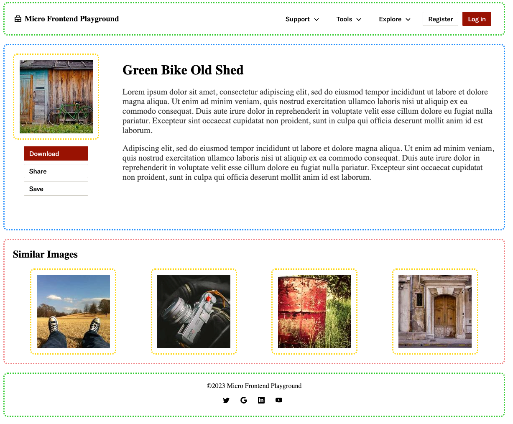

# basic-example
Uses vanilla ModuleFederation. 
Good example to start from.

This project contains 5 applications:

- `home` - The root application host which serves as the main entry point
- `mfe-navigation` - The shared header and footer (port 3002)
- `mfe-image-viewer` - Showcases an image and provides a set of actions to interact with it
- `mfe-image` - Displays an image when given a url
- `mfe-image-recommender` - Recommends other images that are similar

Each app lives in its own directory.
To run the `home` app you must also run each of the MFEs.

Here is what the fully rendered `home` app looks like.
Each dotted line represents a micro frontend (distinguished their color).



```shell
$ cd /<app_dir>
$ yarn install
$ yarn start
```

Or you can build each for production and serve the files:

```shell
$ cd /<app_dir>
$ yarn install
$ yarn build
$ yarn serve 
```

Once started, you can visit the composed `home` app or any of the individual MFEs by using their url:

- `home`: http://localhost:3001
- `mfe-navigation`: http://localhost:3002
- `mfe-image-viewer`: http://localhost:3003
- `mfe-image` - http://localhost:3004
- `mfe-image-recommender` - http://localhost:3005